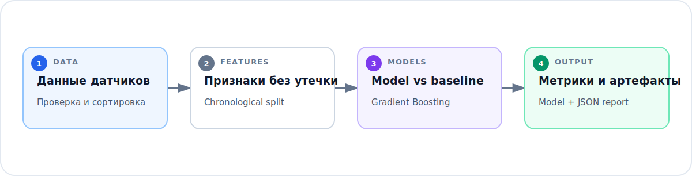

# Прогнозирование концентрации метана

Проект прогнозирует концентрацию метана по последовательности показаний промышленных датчиков. Горизонт прогноза настраивается; в исходном эксперименте он составлял 15 минут при частоте измерений один раз в секунду.

Первая версия появилась как университетская работа по машинному обучению. В старом ноутбуке данные загружались через Google Drive, а выборка делилась случайным образом. Для временного ряда такой подход создавал утечку будущих наблюдений в обучение. В текущей версии используется хронологическое разбиение, а признаки рассчитываются только по данным, доступным на момент прогноза.

## Подход

Пайплайн выполняет четыре шага:

1. Сортирует и проверяет показания датчиков.
2. Строит лаговые, скользящие и циклические временные признаки без обращения к будущим данным.
3. Сдвигает целевую переменную `MM263` на заданный горизонт прогноза.
4. Обучает gradient boosting regressor и сравнивает его с наивным baseline.

Baseline предполагает, что будущее значение метана останется равным последнему измерению. Для медленно меняющегося сигнала это важная точка сравнения: она не позволяет сложной модели выглядеть убедительно только за счёт гладкости временного ряда.



## Запуск

```bash
python -m venv .venv
python -m pip install -e ".[dev]"
python -m methane_forecasting train
```

Команда обучения сохраняет модель и JSON-отчёт в `artifacts/`. Сгенерированные артефакты и локальные данные датчиков исключены из Git.

По умолчанию используется файл `data/filtered_data_frame.csv`. Если его нет, приложение скачивает [исходный публичный датасет с Google Drive](https://drive.google.com/file/d/1hz0dj5TVr0fFPI-mqQf7-s3JkiqQYmrx/view). Загрузка поддерживает продолжение после обрыва и сначала пишет данные в файл `.part`, поэтому незавершённое скачивание не заменит корректный датасет.

Датасет большой и не хранится в Git. Скачать его без запуска обучения можно отдельно:

```bash
python -m methane_forecasting download-data
```

Если файл уже скопирован вручную, оставьте стандартное имя или передайте путь через `--input`. Флаг `--no-download` превращает отсутствие локального файла в ошибку и запрещает автоматическое скачивание.

## Работа с другим датасетом

В исходных данных должна быть числовая целевая колонка `MM263`. Колонка `timestamp` рекомендуется, остальные числовые колонки используются как признаки датчиков.

```bash
python -m methane_forecasting train \
  --input data/another_sensor_export.csv \
  --no-download \
  --horizon 900 \
  --model-output artifacts/model.joblib \
  --report-output artifacts/metrics.json
```

## Проверки

```bash
ruff check .
ruff format --check .
pytest
```

Тесты проверяют поиск датасета без обращения к сети, построение будущей целевой переменной, хронологическое разбиение и полный цикл обучения на сгенерированных данных.

## Структура репозитория

```text
methane_forecasting/   подготовка данных, признаки и обучение модели
notebooks/             краткий разбор эксперимента
tests/                 проверки утечек и работы пайплайна
data/                  локальная папка датасета; CSV исключены из Git
```

## Ограничения

Это офлайн-эксперимент, а не система промышленной безопасности. Для эксплуатации потребуются контроль калибровки датчиков, обработка пропусков, мониторинг drift, согласованные с экспертами пороги оповещений и проверка на данных конкретного предприятия.
